# Arquitectura del pipeline bank-market

## Camino de datos activo

El camino de datos implementado y validado en este repositorio es:

1. Extracción desde Yahoo Finance con Python.
2. Carga idempotente a PostgreSQL `landing.*`.
3. Sincronización incremental a ClickHouse `olap.stg_*`.
4. Rebuild deduplicado hacia `olap.cur_*`.
5. Materialización de mart mensual en `olap.mart_monthly_stock_summary` con dbt (`target=olap`).

Además del DAG principal (`bank_market_pipeline`), existe un DAG desacoplado `bank_market_landing_to_olap` que ejecuta solo la parte `landing -> OLAP -> mart` para casos donde landing sea alimentado por un proceso externo.

```mermaid
flowchart LR
    yahooApi["YahooFinance/yfinance"] --> extractTask["Airflow extract_market_data"]
    extractTask --> loadLanding["Airflow load_landing (PostgreSQL landing.*)"]
    loadLanding --> watermarkCheck["check_new_landing_rows (MAX(ingested_at) vs watermark)"]
    watermarkCheck --> depsTask["dbt_prepare_deps"]
    depsTask --> dbtDev["dbt_validation target=dev (PostgreSQL models)"]
    dbtDev --> loadOlap["load_olap (landing -> olap.stg_* -> rebuild olap.cur_*)"]
    loadOlap --> gateCur["validate_olap_curated"]
    gateCur --> dbtOlap["monthly_summary target=olap (mart_monthly_stock_summary)"]
    dbtOlap --> gateMart["validate_monthly_mart"]
    gateMart --> watermarkCommit["commit_watermark"]
```

## Rol de Airbyte

Airbyte **no** participa en el camino de datos activo anterior. En este repo su rol actual es:

- provisioning/operación local con `abctl`;
- health check operativo para validar disponibilidad de plataforma.

No hay conexiones, jobs ni llamadas API Airbyte que sincronicen `landing -> ClickHouse`.

## Orquestación y schedule

- DAG principal: `bank_market_pipeline` (`0 */6 * * *`) para extracción + carga + validación + mart.
- DAG desacoplado: `bank_market_landing_to_olap` (`*/30 * * * *` por defecto, configurable con `AIRFLOW__PIPELINE__LANDING_TO_OLAP_CRON`) para casos de landing externo.

## Contratos de idempotencia

- `landing.*`: UPSERT por llave natural + `ingested_at`/`batch_id`.
- `olap.stg_*`: append/versionado (`ReplacingMergeTree`), puede crecer físicamente por re-corridas.
- `olap.cur_*`: reconstrucción deduplicada por llave de negocio (sin duplicados lógicos esperados).
- `mart_monthly_stock_summary`: `table` determinista reconstruida por dbt `target=olap`.

## Riesgos operativos conocidos

1. Si una mutación en landing no actualiza `ingested_at`, el watermark puede no detectarla.
2. `stg_*` puede crecer físicamente sin afectar la correctitud de `cur_*`, pero sí costos de almacenamiento/merge.
3. Integrar Airbyte sin definir ownership único de carga puede causar doble escritura.

## Runbook operativo de staging (`stg_*`)

- Verificar conteo físico: `SELECT count() FROM olap.stg_stock_daily_price`.
- Verificar conteo consolidado: `SELECT count() FROM olap.stg_stock_daily_price FINAL`.
- Ejecutar compactación puntual: `OPTIMIZE TABLE olap.stg_stock_daily_price FINAL`.

La compactación debe ejecutarse en ventanas de mantenimiento porque incrementa consumo de recursos.
