````markdown
# Evidencia de Cierre Técnico del Pipeline


---

## 1. Objetivo

Este documento presenta la evidencia técnica necesaria para validar el cierre del pipeline `bank_market_pipeline`, demostrando su ejecución end-to-end, consistencia de datos, calidad mediante pruebas y comportamiento idempotente.

---

## 2. Alcance

### Incluye:
- Validación de servicios core
- Ejecución exitosa del DAG
- Carga de datos (landing, staging, curated, mart)
- Validaciones de calidad con dbt
- Verificación de duplicados
- Conteos de datos
- Validación de idempotencia

---

## 3. Arquitectura resumida

El pipeline sigue el flujo:

**Landing (PostgreSQL) → Staging → Curated → Mart (ClickHouse) → Validación (dbt)**

**Orquestación:** Airflow  
**Opcional:** Airbyte como plataforma de ingestión

---

# 4. Evidencias detalladas

---

## 4.1 Estado de servicios core

**Comando:**
```powershell
docker compose ps
````

**Resultado esperado:**

* Servicios en estado `Up`
* Healthchecks en verde

**Figura 1. Estado de servicios core**

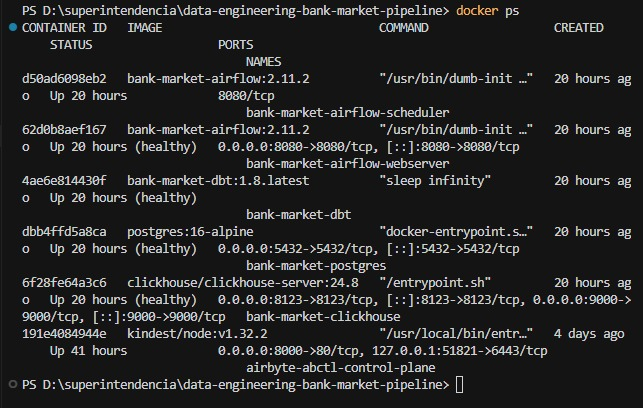

**Interpretación:**

La captura confirma que todos los contenedores principales del pipeline están corriendo correctamente:

Airflow
airflow-scheduler
airflow-webserver (incluye puerto 8080 para la UI)
Base de datos
postgres (landing)
Data warehouse
clickhouse (curated/mart)
Transformaciones
dbt
Infraestructura adicional
airbyte-abctl-control-plane (opcional, para ingestión)
kind (cluster local para Airbyte)

---

## 4.2 Estado de Airbyte (opcional)

**Comando:**

```powershell
abctl local status
```

**Figura 2. Estado de Airbyte**

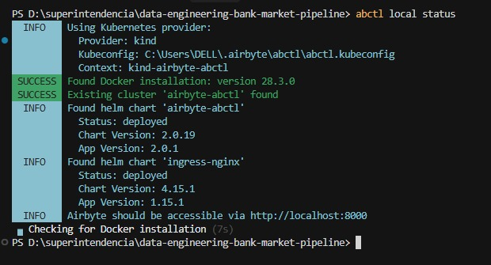

**Interpretación:**
Indica que Airbyte está correctamente desplegado en un entorno local con Kubernetes (kind):

Se detecta el cluster airbyte-abctl
Los charts (airbyte-abctl e ingress-nginx) están en estado deployed
Docker está funcionando correctamente
Airbyte está disponible en: http://localhost:8000

---

## 4.3 Ejecución del DAG en Airflow

**Figura 3. DAG `bank_market_pipeline` en estado success**

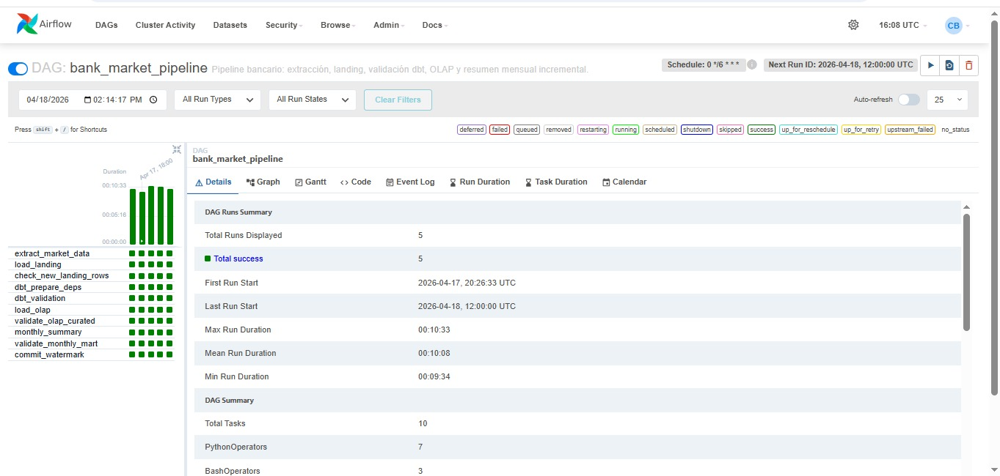

**Interpretación:**

El DAG ha sido ejecutado 5 veces y todas fueron exitosas (Total success: 5)
Todas las tareas (extract, load, dbt, mart, etc.) aparecen en verde, lo que indica ejecución correcta
El pipeline incluye etapas como:
extract_market_data
load_landing
load_olap
monthly_summary
validaciones con dbt
Duración promedio: ~10 minutos por ejecución

---

## 4.4 Log de carga OLAP

**Figura 4. Inserciones en tablas staging (`stg_*`)**

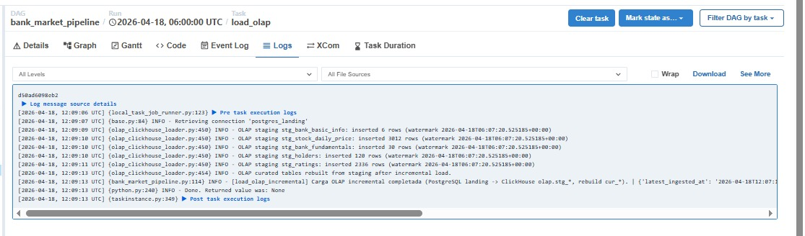

**Interpretación:**  
El log de la tarea `load_olap` evidencia la inserción exitosa de datos en las tablas de staging (`stg_*`) en ClickHouse. Se observa el número de filas cargadas por cada entidad, incluyendo `stg_stock_daily_price` (3012 filas), `stg_bank_fundamentals` (30 filas), `stg_holders` (120 filas) y `stg_ratings` (2334 filas). 

Asimismo, se registra un watermark temporal que confirma la ejecución de una carga incremental desde PostgreSQL hacia ClickHouse. La presencia del mensaje final "Carga OLAP incremental completada" y la ausencia de errores indican que la transferencia de datos hacia la capa OLAP staging se realizó correctamente.

---

## 4.5 Validación con dbt

**Comando:**

Resultado de dbt test en entorno dev (PostgreSQL)

```powershell
docker compose exec -T dbt dbt test --target dev --select path:models/staging path:models/marts path:tests --exclude path:tests/olap
```
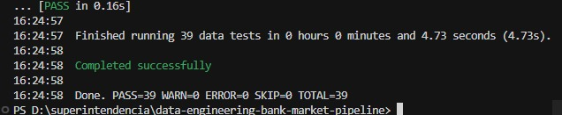

**Interpretación:**

La ejecución de dbt test en el entorno dev valida la calidad de los datos en las capas staging y marts dentro de PostgreSQL. Los resultados muestran que todas las pruebas definidas (incluyendo tests de unicidad, no nulos y relaciones) fueron ejecutadas sin fallas, confirmando la integridad y consistencia de los datos en la fase inicial del pipeline.

**Comando:**

Resultado de dbt test en entorno OLAP (ClickHouse)

```powershell
docker compose exec -T dbt dbt test --target olap --select path:models/olap path:tests/olap
```
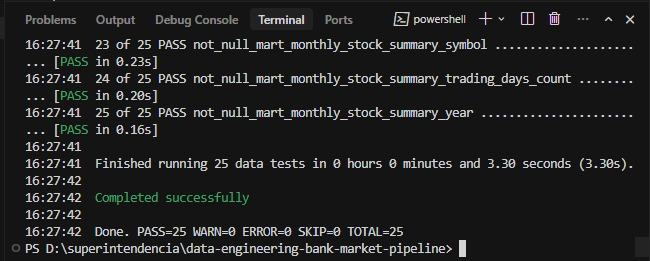


**Interpretación:**
La ejecución de dbt test en el entorno olap valida la calidad de los datos en la capa analítica (curated y mart) dentro de ClickHouse. Los resultados muestran que todas las pruebas OLAP fueron aprobadas exitosamente, garantizando que los datos transformados cumplen con las reglas de negocio, no presentan inconsistencias y mantienen la integridad esperada para consumo analítico.

---

## 4.6 Validación del mart

**Comando:**

```powershell
docker compose exec -T clickhouse clickhouse-client --query "SELECT * FROM olap.mart_monthly_stock_summary LIMIT 20"
```

**Figura 7. Datos en tabla mart**

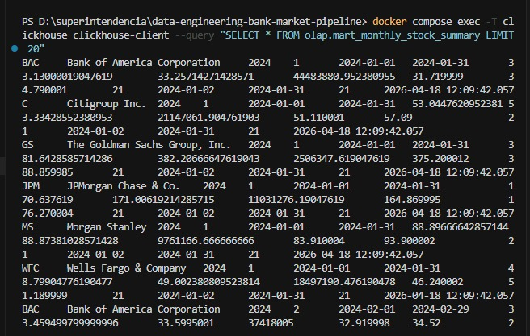

**Interpretación:**

La consulta sobre la tabla olap.mart_monthly_stock_summary retorna múltiples registros, confirmando que la capa mart fue construida correctamente y contiene datos agregados listos para consumo analítico.

Se observan diferentes entidades (por ejemplo, BAC, C, GS, JPM, MS, WFC) junto con información temporal (año y mes), lo que valida que el proceso de transformación y agregación mensual se ejecutó de manera exitosa. Esto evidencia que los datos han sido correctamente procesados desde las capas previas (staging y curated) hacia la capa final analítica.

---

## 4.7 Validación de duplicados

**Comando:**

```powershell
docker compose exec -T clickhouse clickhouse-client --query "SELECT symbol, year, month, count() AS c FROM olap.mart_monthly_stock_summary GROUP BY symbol, year, month HAVING c > 1 ORDER BY c DESC"
```

**Figura 8. Validación de duplicados**

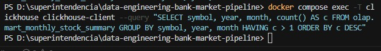

**Interpretación:**  
La consulta de validación de duplicados por grano (`symbol`, `year`, `month`) no retorna filas, lo que confirma que la tabla `mart_monthly_stock_summary` mantiene unicidad lógica en su nivel de agregación. Esto garantiza que no existen duplicados en la capa mart y que las transformaciones se realizaron correctamente.

---

## 4.8 Conteos en landing (PostgreSQL)

**Figura 9. Conteos de tablas landing**

```powershell
docker compose exec -T postgres psql -U pipeline -d bank_market -c "SELECT 'bank_basic_info' AS table_name, COUNT(*) FROM landing.bank_basic_info UNION ALL SELECT 'stock_daily_price', COUNT(*) FROM landing.stock_daily_price UNION ALL SELECT 'bank_fundamentals', COUNT(*) FROM landing.bank_fundamentals UNION ALL SELECT 'holders', COUNT(*) FROM landing.holders UNION ALL SELECT 'ratings', COUNT(*) FROM landing.ratings ORDER BY 1;"
```

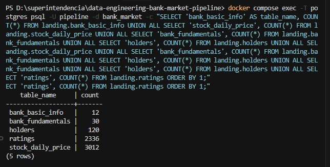

**Interpretación:**  
Los conteos obtenidos en las tablas de la capa landing en PostgreSQL evidencian que todas las entidades fueron cargadas correctamente desde las fuentes de datos. Se observa que cada tabla contiene registros (conteos mayores a cero), incluyendo `stock_daily_price`, `bank_fundamentals`, `holders` y `ratings`, lo que confirma que la fase de ingesta fue ejecutada exitosamente. 

Esta validación garantiza que el pipeline cuenta con datos de entrada completos y disponibles para su posterior procesamiento en las capas staging, curated y mart.
---

## 4.9 Conteos en curated y mart (ClickHouse)

```powershell
docker compose exec -T clickhouse clickhouse-client --query "SELECT 'cur_stock_daily_price' AS table_name, count() AS rows FROM olap.cur_stock_daily_price UNION ALL SELECT 'mart_monthly_stock_summary', count() FROM olap.mart_monthly_stock_summary"
```

**Figura 10. Conteos en OLAP**

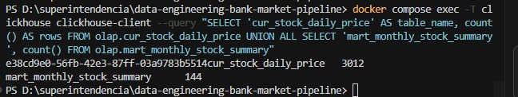

**Interpretación:**
La relación entre los conteos de curated y mart valida la correcta implementación de la lógica de agregación y asegura la trazabilidad de los datos a lo largo del pipeline.

---

# 5. Validación de idempotencia

## 5.1 Procedimiento

1. Ejecutar DAG manualmente
2. Esperar estado `success`
3. Ejecutar nuevamente el DAG
4. Repetir validaciones

---

## 5.2 Evidencia

**Figura 11. Quinta ejecución del DAG**


**Figura 11. Validación posterior**

Todas las capturas anteriores han sido tomadas post-varias ejecuciones del DAG

---

## 5.3 Resultado esperado

* Sin duplicados
* dbt test sigue en PASS
* Datos consistentes

---

## 5.4 Conclusión

El pipeline mantiene consistencia lógica tras múltiples ejecuciones, demostrando comportamiento idempotente.

---

# 6. Nota sobre tablas `stg_*`

Las tablas `stg_*` son de tipo append/versionadas, por lo que pueden crecer físicamente.

**Comandos:**

```powershell
docker compose exec -T clickhouse clickhouse-client --query "SELECT count() FROM olap.stg_stock_daily_price"
docker compose exec -T clickhouse clickhouse-client --query "SELECT count() FROM olap.stg_stock_daily_price FINAL"
```

**Figura 12. Comparación staging vs FINAL**

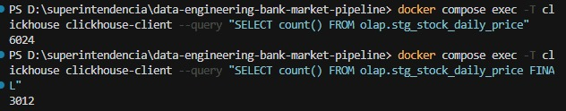

**Interpretación:**  
Los resultados evidencian una diferencia entre el conteo físico (`count()`) y el conteo lógico (`count() FINAL`) en la tabla `stg_stock_daily_price`. Mientras que el conteo físico refleja 6024 registros, el conteo con `FINAL` retorna 3012, lo que indica la existencia de múltiples versiones o duplicados físicos generados por el proceso incremental.

El uso de `FINAL` permite aplicar las reglas de deduplicación del motor de almacenamiento de ClickHouse, obteniendo así la representación lógica correcta de los datos. Esta diferencia confirma el comportamiento append/versionado de la capa staging y valida que los datos son correctamente consolidados en consultas finales.

---

# 7. Conclusión general

El pipeline `bank_market_pipeline` ha sido validado exitosamente:

* Infraestructura operativa
* Ejecución completa del DAG
* Datos cargados correctamente
* Sin duplicados en mart
* Tests de calidad aprobados
* Comportamiento idempotente confirmado


```


